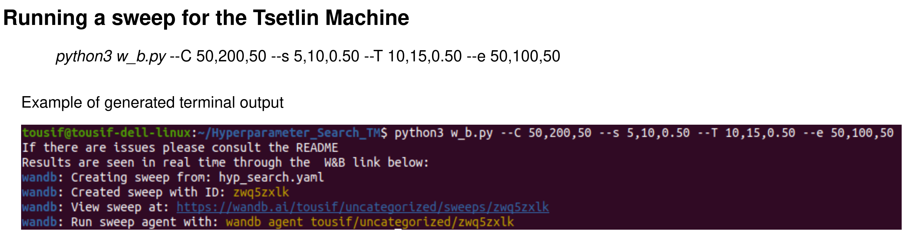
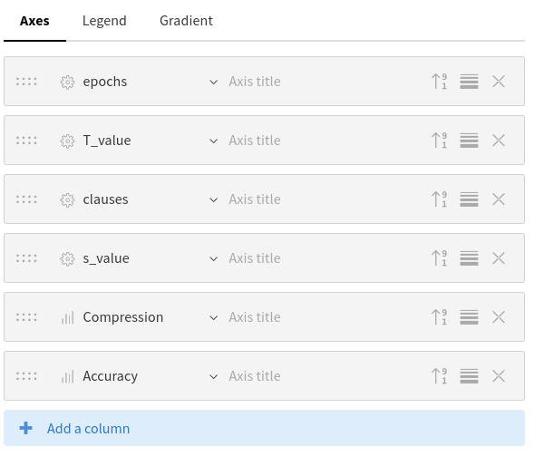

# TMASP - Tsetlin Machine Architecture Search Paradigm

## About
This code allows users to determine optimum architecture for Tsetlin Machines for a given classification task.
The tuned parameters are: Number clauses per class, s-hyperparamter, T-hyperparamter 
Booleanized data is provided in the /Boolean_datasets folder


## Setup

1) Create a weights and biases account: https://wandb.ai/site

2) Install the requirements:
    
```
pip3 install wandb

```

3) Extract Boolean_datasets.zip in the same folder. Select the dataset from /Boolean_datasets and put the file path into search.c in lines 28 and 45 for training and testing dataset respectively. 

4) Comment and uncomment the following depending on the dataset under consideration in files UserSetup.h and UserSetup2.h. For example, below the configuration represents setting for MNIST, Fashion MNIST and Kuzushiji-MNIST which have 784 features, 10 classes, 60k training samples and 10k testing samples. While the configurations for CIFAR2 and KWS6 are commented out.

CIFAR2:

		// #define CLASSES 2
		// #define FEATURES 1024
		// #define NUMBER_OF_EXAMPLES 50000
		// #define NUMBER_OF_VALI_EXAMPLES 10000

KWS6:

		// #define CLASSES 6
		// #define FEATURES 377
		// #define NUMBER_OF_EXAMPLES 15000
		// #define NUMBER_OF_VALI_EXAMPLES 3120

MNIST, FMNIST, KMNIST:

		#define CLASSES 10
		#define FEATURES 784
		#define NUMBER_OF_EXAMPLES 60000
		#define NUMBER_OF_VALI_EXAMPLES 10000

## Run
```
python3 w_b.py --C 50,200,50 --s 5,10,0.50 --T 10,15,0.50 --e 50,100,50 --run MNIST
```

    What the above means: 

        --C 50 200 50   : go from 50 to 200 clauses in increments of 50
        --s 5 10 0.50   : go from 5 to 10 in s value in increments of 0.50
        --T 10 15 0.50  : go from 10 to 15 in T value in increments of 0.50
        --e 50 100 50   : go from 50 to 100 in epochs in increments of 50
        --run MNIST     : The name of the W&B run is called MNIST

In this example the resulting TA files will be stored in 
An example terminal output is given below: MNIST_TMASP_TA_files




## Collect Data

```
python3 collect_data.py
```
All data can be seen online through weights and biases. 
All data can be seen offline through an sqlite database. 
The raw TA files will be stoed in a directory such as "RUN_NAME_TMASP_TA_files"

This script will convert the offline database containing the runs into a csv file called search_results.csv. 

## WANDB_AI

The dashboard in wandb will require some editing to display includes and accuracy properly. To do this select the sweep image
and select the edit option. Then use the 'Add a column' (as seen below) to find the accuray and include data.



For any queries please contact Tousif Rahman: S.Rahman@newcastle.ac.uk
Other contacts: sidharth.maheshwari@newcastle.ac.uk, rishad.shafik@newcastle.ac.uk